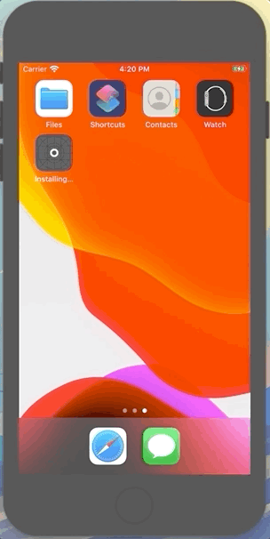

Twitter
==========
Twitter clone сreated using manual from  [LBTA](https://www.letsbuildthatapp.com/course_video?id=662).
I learned a lot from this project:
* auto layout
* Dynamic Cell Sizing
* MVC
* Dynamic Cell Sizing
* Custom Navigation Bar
* Custom Tweet Cells
* UIStackView Landscape and Device Sizing Support
* JSON Parsing with TRON
* Handling Network and JSON Errors
* Caching and Loading Images
* LBTAComponents

## Screenshots

